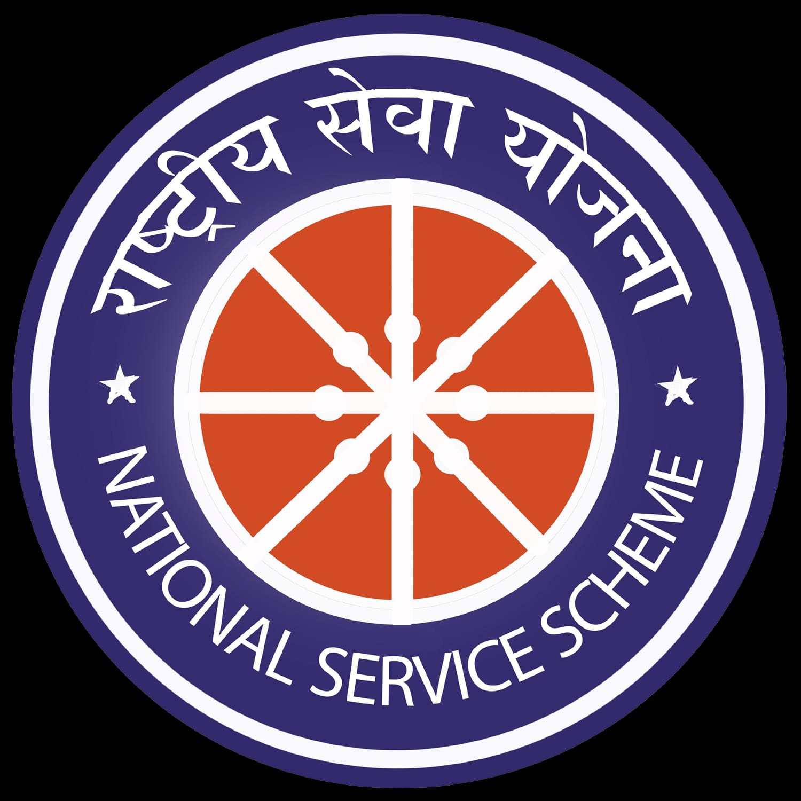
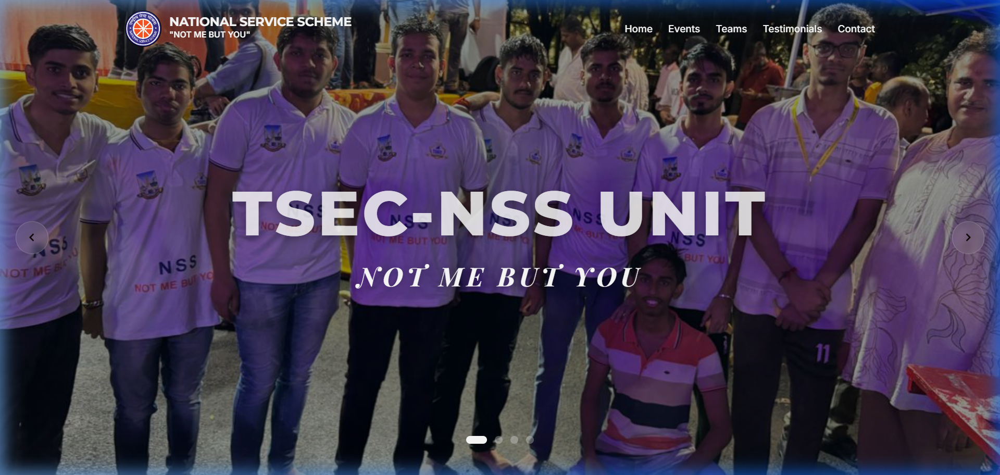
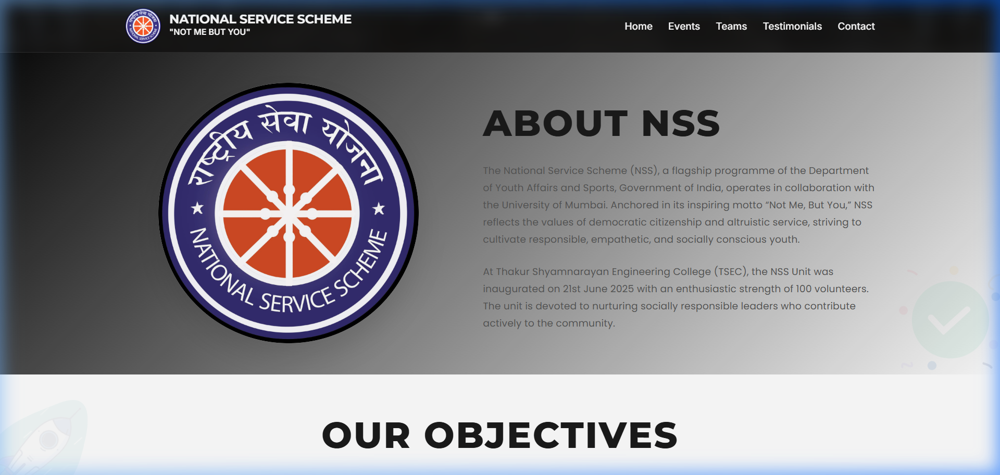
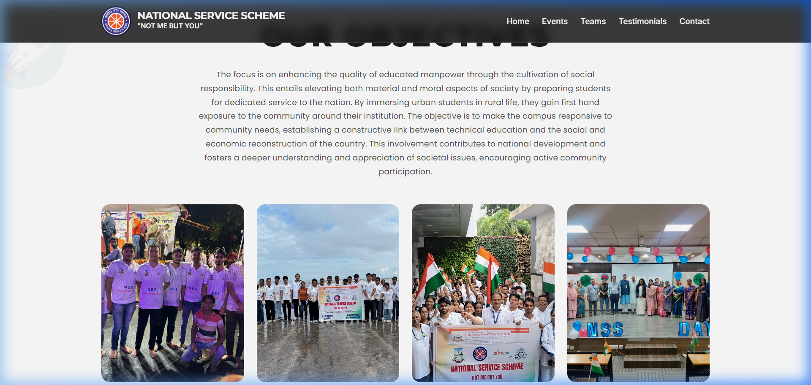
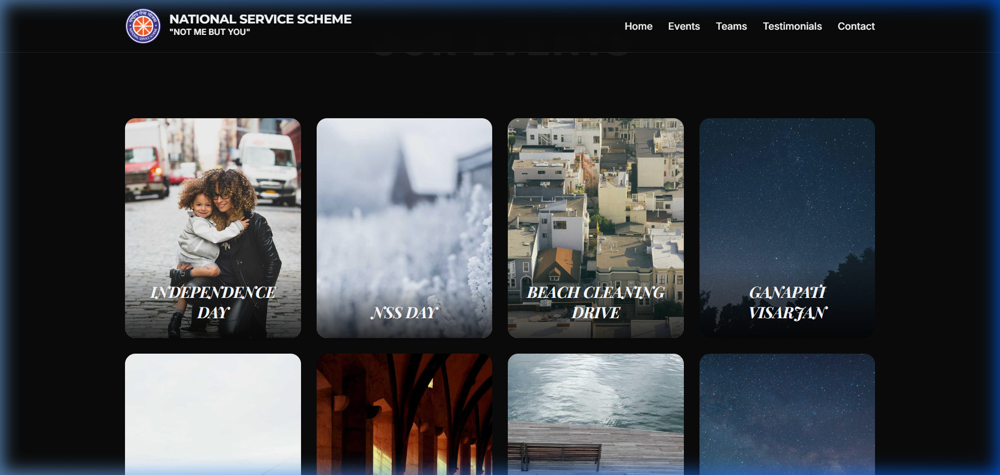
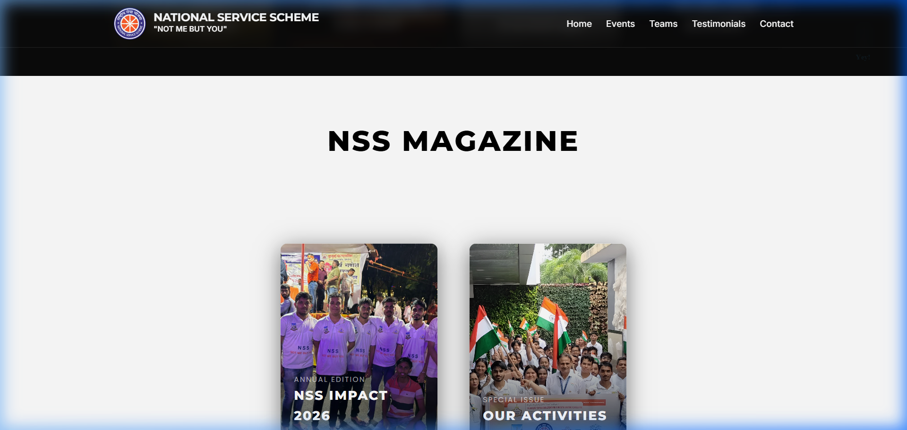
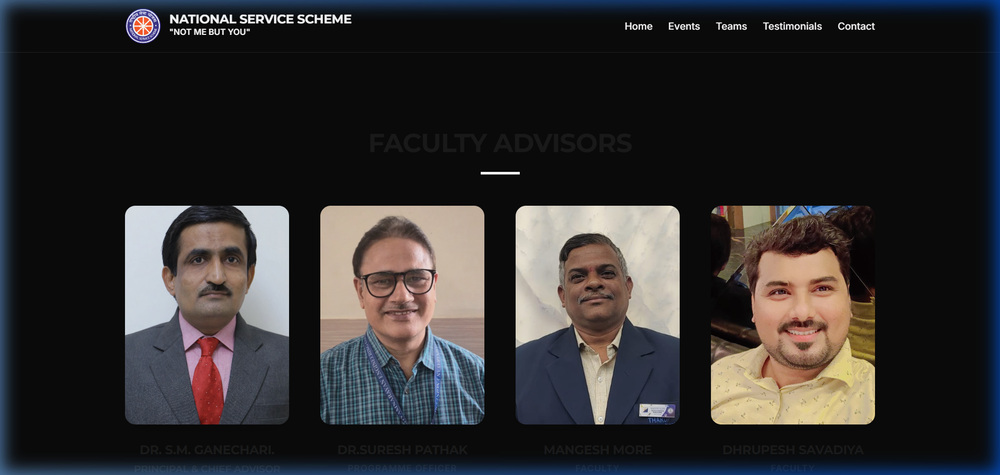
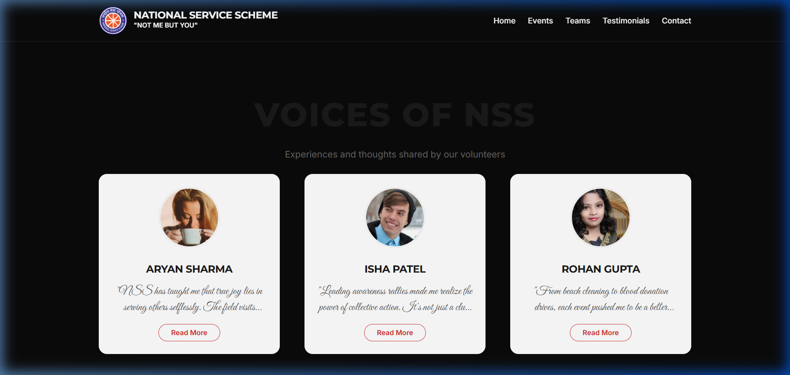

# NSS TSEC Mumbai - National Service Scheme

[](https://github.com/Bhavesh1411/NSS-website)

A premium, cinematic web platform for the **National Service Scheme (NSS)** unit of **Thakur Shyamnarayan Engineering College (TSEC)**. Built with modern web technologies to showcase the unit's events, impact, and social service initiatives.

## 🌟 Key Features

- **Cinematic Experience**: Smooth transitions and entry animations using GSAP and ScrollTrigger.
- **Interactive 3D Magazine**: A custom-built, interactive CSS/JS magazine viewer showcasing past activities.
- **Dynamic Event Timeline**: Visual journey through NSS TSEC's flagship events.
- **Responsive Design**: Fully optimized for all screen sizes.
- **Lottie Animations**: High-quality vector animations for an engaging UI.

---

## 📸 Visual Walkthrough

### 🏠 Hero Section
Welcome to the TSEC-NSS Unit. "Not Me, But You."


### ℹ️ About NSS
Learn about the mission and history of the National Service Scheme at TSEC.


### 🎯 Our Objectives
Interactive cards highlighting the core pillars of our community engagement.


### 📅 Our Events
A curated gallery of our most impactful events, from Independence Day to Hackspark.


### 📖 NSS Magazine
Explore our "NSS Impact" annual edition in a stunning, interactive viewer.


### 👥 Our Teams
Meet the dedicated volunteers and leaders driving our mission.


### 💬 Testimonials
Real stories and voices from the NSS TSEC community.


---

## 🛠️ Technologies Used

- **HTML5 & CSS3**: Semantic structure and custom styling.
- **JavaScript (Vanilla)**: Core logic and interactivity.
- **GSAP (GreenSock Animation Platform)**: Cinematic scroll-triggered animations.
- **ScrollTrigger**: Advanced scroll-based interactions.
- **Lottie**: Lightweight vector animations.
- **Google Fonts**: Inter & Montserrat for premium typography.

---

## 🚀 Getting Started

### Prerequisites
- A modern web browser (Chrome, Firefox, Safari).

### Local Setup
1. Clone the repository:
   ```bash
   git clone https://github.com/Bhavesh1411/NSS-website.git
   ```
2. Open `index.html` in your browser.
3. (Optional) Run a local server for the best experience:
   ```bash
   python -m http.server 8000
   ```
   Then visit `http://localhost:8000`.

---

## 🤝 Join Us
"Not Me, But You." Join us in serving society and building a better nation.

**Developed with ❤️ for NSS TSEC Mumbai**
